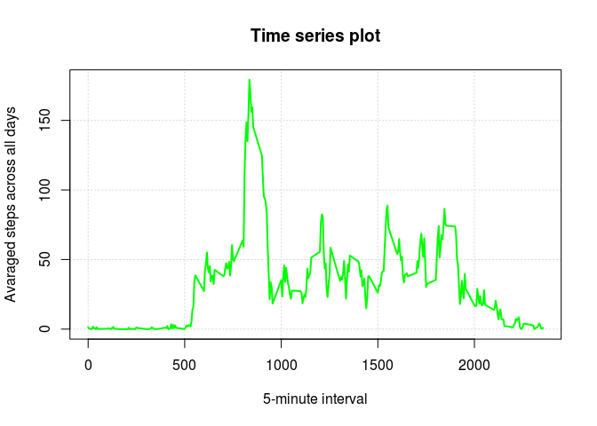
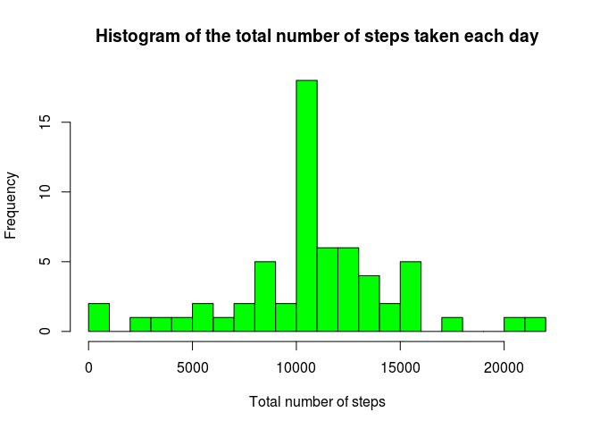
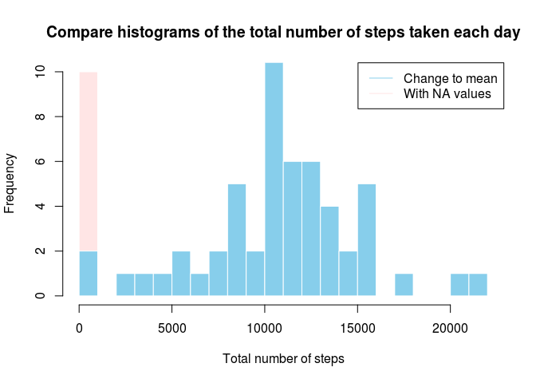
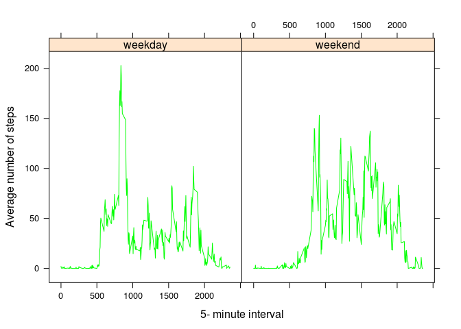

<font color = "green"> Personal activity monitoring </font>
===========================================================

This assignment makes use of data from a personal activity monitoring device. This device collects data at 5 minute intervals through out the day. The data consists of two months of data from an anonymous individual collected during the months of October and November, 2012 and include the number of steps taken in 5 minute intervals each day.

The data for this assignment can be downloaded from the course web site:

<b>Dataset: </b> <a href="https://d396qusza40orc.cloudfront.net/repdata%2Fdata%2Factivity.zip">Activity monitoring data \[52K\]</a>

The variables included in this dataset are:

-   <b>steps:</b> Number of steps taking in a 5-minute interval (missing values are coded as 𝙽𝙰)

-   <b>date:</b> The date on which the measurement was taken in YYYY-MM-DD format

-   <b>interval:</b> Identifier for the 5-minute interval in which measurement was taken

The dataset is stored in a comma-separated-value (CSV) file and there are a total of 17,568 observations in this dataset.

<font color = "green"> Loading and preprocessing data </font>
-------------------------------------------------------------

     First we must load data, it's simply because 
     data are saved in .csv format 

``` r
DF <- read.csv("activity.csv", header = TRUE, sep = ",")
head(DF)
```

    ##   steps       date interval
    ## 1    NA 2012-10-01        0
    ## 2    NA 2012-10-01        5
    ## 3    NA 2012-10-01       10
    ## 4    NA 2012-10-01       15
    ## 5    NA 2012-10-01       20
    ## 6    NA 2012-10-01       25

``` r
str(DF)
```

    ## 'data.frame':    17568 obs. of  3 variables:
    ##  $ steps   : int  NA NA NA NA NA NA NA NA NA NA ...
    ##  $ date    : Factor w/ 61 levels "2012-10-01","2012-10-02",..: 1 1 1 1 1 1 1 1 1 1 ...
    ##  $ interval: int  0 5 10 15 20 25 30 35 40 45 ...

     We can change class of data to Date

``` r
DF$date <- as.Date(as.character(DF$date))
```

<font color = "green"> What is mean total number of steps taken per day? </font>
--------------------------------------------------------------------------------

     (We ignore missing values to calculate mean and median !)
     * We calculate total number of steps taken per day
     First replace NA to 0 

``` r
DF[is.na(DF)] <- 0
```

     Now we can calculate number of steps

``` r
sumofDF <- tapply(DF$steps, DF$date, sum)
```

### Plot histogram

``` r
hist(sumofDF, breaks = 20, freq = TRUE, 
     col = "green", 
     xlab = "Total number of steps", 
     main = "Histogram of the total number of steps taken each day")
```


Mean of the total number of steps taken per day

``` r
mean(sumofDF)
```

    ## [1] 9354.23

Median of the total number of steps taken per day

``` r
median(sumofDF)
```

    ## [1] 10395

<font color = "green"> What is the average daily activity pattern </font>
-------------------------------------------------------------------------

     Time series plot of the 5-minute interval and 
     the avarage number of steps taken, avaraged across all days

``` r
intervalmean <- tapply(DF$steps, DF$interval, mean)
with(DF, plot(unique(interval), intervalmean, 
              type = "l", lwd = 2,
              col = "green",
              panel.first = grid(),
              xlab = "5-minute interval",
              ylab = "Avaraged steps across all days",
              main = "Time series plot"))
```



     Now check which 5-minute interval contains the maximum
     number of steps

``` r
intervalmean[which.max(intervalmean)]
```

    ##      835 
    ## 179.1311

     We see the 835 interval contains maximum number of steps
     In other words people make most steps at 8:35 AM
     

<font color = "green"> Imputing missing values </font>
------------------------------------------------------

     Now we calculate total number of missing values in the dataset
     We must read data one more time first
     

``` r
DF <- read.csv("activity.csv", header = TRUE, sep = ",")
```

          Now we can check how many missing values are in 
          column steps. ( In date and interval we don't have missing values)

``` r
table(is.na(DF$steps))
```

    ## 
    ## FALSE  TRUE 
    ## 15264  2304

``` r
mean(is.na(DF$steps)) * 100
```

    ## [1] 13.11475

     It's not bad only 13% of values are missing 
     
     Now fill mean for 5-minute interval for all days to all of the missing values 
     in the dataset. For it we use dplyr library

``` r
library(dplyr)
```

    ## 
    ## Attaching package: 'dplyr'

    ## The following objects are masked from 'package:stats':
    ## 
    ##     filter, lag

    ## The following objects are masked from 'package:base':
    ## 
    ##     intersect, setdiff, setequal, union

``` r
DF1 <- DF %>% group_by(interval) %>% mutate(steps = ifelse(is.na(steps), mean(steps, na.rm = TRUE), steps))
head(DF1)
```

    ## # A tibble: 6 x 3
    ## # Groups:   interval [6]
    ##       steps       date interval
    ##       <dbl>     <fctr>    <int>
    ## 1 1.7169811 2012-10-01        0
    ## 2 0.3396226 2012-10-01        5
    ## 3 0.1320755 2012-10-01       10
    ## 4 0.1509434 2012-10-01       15
    ## 5 0.0754717 2012-10-01       20
    ## 6 2.0943396 2012-10-01       25

     Make a histogram of the total number of steps taken each day 
     for new data frame with filled missing values

``` r
sumofDF1 <- tapply(DF1$steps, DF1$date, sum)

hist(sumofDF1, breaks = 20, freq = TRUE, 
     col = "green", 
     xlab = "Total number of steps", 
     main = "Histogram of the total number of steps taken each day")
```



Check mean

``` r
mean(sumofDF1)
```

    ## [1] 10766.19

and median

``` r
median(sumofDF1)
```

    ## [1] 10766.19

### Now we can compare histograms

``` r
hist(sumofDF, breaks = 20,
     col = scales::alpha('red', .1), 
     border = FALSE,
     xlab = "Total number of steps",
     main = "Compare histograms of the total number of steps taken each day")
hist(sumofDF1, breaks = 20, 
     col = "skyblue",
     border = FALSE,
     add = TRUE)
legend("topright", c("Change to mean", "With NA values"), 
       col = c("skyblue", scales::alpha('red', .1)), 
       lty = c(1,1))
```



<font color = "green"> Differences in activity patterns between weekdays and weekends </font>
---------------------------------------------------------------------------------------------

First prepare new factor variable which define is it weekday or weekend day for this we use <b> chron </b> library

``` r
library(chron)
DF$day[is.weekend(DF$date)] <- 'weekend'
DF$day[!is.weekend(DF$date)] <- 'weekday'

table(DF$day)
```

    ## 
    ## weekday weekend 
    ##   12960    4608

At the end we make a plot containing a time series plot of the 5-minute interval and the average number of steps taken, average across all weekday days or weekend days. We use <b> lattice </b> library

``` r
library(lattice)
DF[is.na(DF)] <- 0
meanDF <- aggregate(DF[,1], list(interval = DF$interval, day = DF$day), mean)
xyplot(x ~ interval | factor(day), data = meanDF, 
       type = "l", col = "green",
       xlab = "5- minute interval",
       ylab = "Average number of steps")
```


